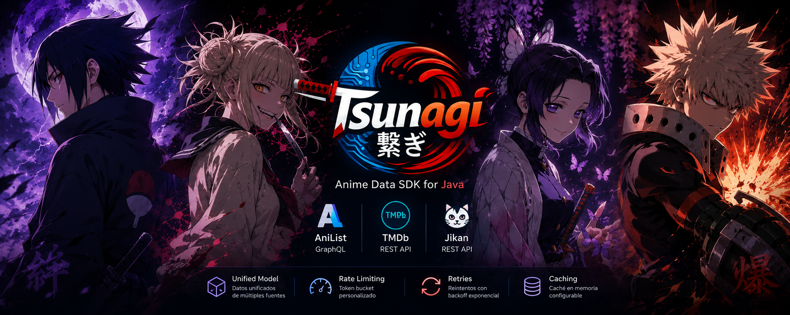

<div align="center">


# Tsunagi 繋ぎ

**Anime Data SDK for Java.** One client for [AniList](https://anilist.co), [TMDb](https://www.themoviedb.org) and [Jikan](https://jikan.moe) — three very different APIs behind a single, unified model.

[](https://github.com/diegoalegil/tsunagi/actions/workflows/ci.yml)
[](https://central.sonatype.com/artifact/io.github.diegoalegil/tsunagi)
[](LICENSE)
[](https://adoptium.net/)



</div>

---

## What is Tsunagi?

Tsunagi is a small, dependency-light Java SDK that fetches anime data. Instead of
learning three different APIs, you make one call and get back one consistent
[`Anime`](src/main/java/io/github/diegoalegil/tsunagi/model/Anime.java) object.

```
three APIs  ──►  Tsunagi  ──►  one Anime model
```

> **Tsunagi** (繋ぎ) means *connection*, *link*, *the piece that joins things together*.

### The problem it solves

Each anime API speaks its own language:

| Source | Protocol | Auth | Quirks |
|--------|----------|------|--------|
| **AniList** | GraphQL | none | titles in 3 languages, `null` everywhere, 404 on "not found" |
| **TMDb** | REST | Bearer token | TV-oriented, scores 0–10, posters as relative paths |
| **Jikan** | REST | none | strict 3 requests/second limit, scores 0–10 |

Learning all three — GraphQL queries, Bearer headers, rate limits, three JSON
shapes — just to show an anime card is a lot. Tsunagi hides all of it and also
handles rate limiting, retries, caching and timeouts for you.

## Installation

```xml
<dependency>
    <groupId>io.github.diegoalegil</groupId>
    <artifactId>tsunagi</artifactId>
    <version>1.3.0</version>
</dependency>
```

Requires **Java 17+**.

## Quick start

```java
import io.github.diegoalegil.tsunagi.TsunagiClient;
import io.github.diegoalegil.tsunagi.TsunagiConfig;
import io.github.diegoalegil.tsunagi.model.Anime;

import java.util.Optional;

TsunagiConfig config = TsunagiConfig.builder()
        .tmdbToken(System.getenv("TMDB_TOKEN")) // optional
        .cacheEnabled(true)
        .build();

TsunagiClient tsunagi = new TsunagiClient(config);

Optional<Anime> result = tsunagi.searchAnime("Frieren");

result.ifPresent(anime -> {
    System.out.println(anime.title());        // Sousou no Frieren
    System.out.println(anime.year());         // 2023
    System.out.println(anime.averageScore()); // e.g. 90.0 (always 0–100)
    System.out.println(anime.genres());       // [Adventure, Drama, Fantasy]
});
```

## The unified model

The result is always the same `Anime`, no matter which source answered:

```java
public record Anime(
        String id,            // e.g. "anilist:1"
        String title,
        Integer year,
        String description,
        String imageUrl,
        Double averageScore,  // normalised to 0–100 across all sources
        List<String> genres,  // never null (empty when unknown)
        Integer episodes,
        String status,        // airing status as reported by the source
        String source         // "AniList", "TMDb" or "Jikan"
) {}
```

A field a source does not provide is `null` (or an empty list for `genres`).

## How it works

`searchAnime` orchestrates the three sources so you don't have to:

1. **Cache** — if enabled and the title was looked up recently, return it immediately.
2. **AniList** is queried first as the primary source.
3. **TMDb** fills in any missing fields (e.g. a poster) when a token is configured — *best-effort*: a TMDb failure never fails your search.
4. **Jikan** is the fallback when AniList has no match.

Scores from every source are normalised to a **0–100** scale, so `averageScore`
always means the same thing.

## Configuration

Everything is set through the `TsunagiConfig` builder. All options are optional
and have sensible defaults:

```java
TsunagiConfig config = TsunagiConfig.builder()
        .tmdbToken(System.getenv("TMDB_TOKEN"))    // default: none (TMDb disabled)
        .cacheEnabled(true)                        // default: false
        .cacheTtl(Duration.ofMinutes(10))          // default: 10 minutes
        .cacheMaxSize(1000)                        // default: 1000 (LRU eviction)
        .retryEnabled(true)                        // default: true
        .retryMaxAttempts(3)                       // default: 3
        .retryInitialDelay(Duration.ofMillis(500)) // default: 500 ms
        .requestTimeout(Duration.ofSeconds(30))    // default: 30 seconds
        .userAgent("MyApp/1.0 (+https://example.com)") // default: none — see note
        .build();
```

| Option | Required | Default |
|--------|----------|---------|
| `tmdbToken` | optional | none (TMDb enrichment skipped) |
| `cacheEnabled` / `cacheTtl` / `cacheMaxSize` | optional | `false` / 10 min / 1000 |
| `retryEnabled` / `retryMaxAttempts` / `retryInitialDelay` | optional | `true` / 3 / 500 ms |
| `requestTimeout` | optional | 30 s |
| `userAgent` | optional | none |

> **Note on `userAgent`:** the JDK treats `User-Agent` as a restricted header, so it
> is only sent when you set it *and* start the JVM with
> `-Djdk.httpclient.allowRestrictedHeaders=user-agent`. Some sources behind a CDN
> (e.g. AniList via Cloudflare) require an identifiable User-Agent.

### TMDb token

The TMDb token is a **v4 read access token**, taken from your environment — never
hardcode it. Without it, Tsunagi simply skips the TMDb enrichment step and relies
on AniList and Jikan.

## Error handling

All failures are unchecked and rooted at `TsunagiException`, so you only catch
what you care about:

```java
try {
    Optional<Anime> anime = tsunagi.searchAnime("Frieren");
} catch (RateLimitException e) {
    // a source returned HTTP 429
} catch (ApiException e) {
    System.err.println(e.source() + " failed with " + e.statusCode());
} catch (TsunagiException e) {
    // any other Tsunagi failure (network, timeout, parsing, ...)
}
```

| Exception | Meaning |
|-----------|---------|
| `TsunagiException` | base type for every Tsunagi error |
| `ApiException` | a source returned a non-2xx status (`source()`, `statusCode()`) |
| `RateLimitException` | a source returned HTTP 429 |
| `SourceUnavailableException` | network failure, timeout or interruption |

Transient failures (network, 5xx, 429) are retried with exponential backoff;
client errors (4xx) fail fast.

## Using the sources directly

The three clients are public, so you can use one on its own — and they expose
much more than the unified `searchAnime`.

```java
AniListClient anilist = new AniListClient();
TmdbClient    tmdb    = new TmdbClient(System.getenv("TMDB_TOKEN"));
JikanClient   jikan   = new JikanClient(); // owns a 3 req/s rate limiter

Optional<Anime> anime = anilist.searchAnime("Naruto"); // unified Anime, like the facade
```

Each client also has a **canonical constructor** that accepts an optional
`userAgent`, a `RetryPolicy` and a `TokenBucketRateLimiter`, so you can add
identification, retries and rate limiting per source:

```java
AniListClient anilist = new AniListClient(
        Duration.ofSeconds(30),
        "MyApp/1.0 (+https://example.com)",                  // userAgent — opt-in (see note above)
        RetryPolicy.exponentialBackoff(3, Duration.ofMillis(500)),
        new TokenBucketRateLimiter(3, Duration.ofSeconds(1)));

// Jikan also accepts an optional RetryPolicy (since 1.3.0):
JikanClient jikan = new JikanClient(
        new TokenBucketRateLimiter(3, Duration.ofSeconds(1)),
        RetryPolicy.exponentialBackoff(3, Duration.ofMillis(500)));
```

> **Resilience & nullability (1.3.0).** Every client retries transient failures
> (`429`/`5xx`/network) when given a `RetryPolicy` — including the main
> `searchAnime` path — and AniList rate limits (which arrive as HTTP 200 with a
> GraphQL `errors` array) surface as `RateLimitException` instead of an empty
> result. The public API is annotated with [JSpecify](https://jspecify.dev)
> ([`@NullMarked`](https://jspecify.dev) by default, `@Nullable` where a value is
> optional), so your IDE flags missing null checks. The annotations are
> `provided`-scoped and never reach your runtime classpath.

### AniList — rich models & popular feed (since 1.1.0)

`fetchPopular(count)` returns the most popular anime (paginated internally,
50/page) as source-shaped `AniListMedia` records carrying everything AniList
provides — far more than the unified `Anime`:

```java
List<AniListMedia> popular = anilist.fetchPopular(50);
for (AniListMedia m : popular) {
    m.title().romaji();       // also .english(), .nativeTitle() (1.2.0)
    m.synonyms();             // alternative titles (1.2.0)
    m.startDate();            // fuzzy date: year / month / day (any may be null)
    m.episodes();             // + duration, format, status, averageScore, popularity, description
    m.coverImage().large();   // + bannerImage(), genres(), season()/seasonYear()
    m.studios().nodes();      // studios, each with isAnimationStudio
    m.characters().edges();   // up to 6 MAIN characters (role, name.full()/nativeName(), image)
    m.tags();                 // tags with a relevance rank
}
```

### TMDb — search, details, providers, trailers (since 1.1.0)

Every method takes the `language` as a parameter (pass `null`/blank to omit it).
IDs, poster and logo paths are returned raw.

| Method | Endpoint | Returns |
|--------|----------|---------|
| `searchTv(query, lang)` | `/search/tv` | TV results |
| `searchMulti(query, lang)` *(1.2.0)* | `/search/multi` | TV **and** movies (`media_type`) |
| `getTvDetails(id, lang)` | `/tv/{id}` | localized overview |
| `getWatchProviders(id)` | `/tv/{id}/watch/providers` | providers by country (flatrate/free/rent/buy) |
| `getTrailers(id, lang)` | `/tv/{id}/videos` | videos (e.g. YouTube trailers) |

```java
TmdbSearchResponse res = tmdb.searchMulti("Suzume", "es-ES");
for (TmdbSearchResult r : res.results()) {
    if (r.isTv() || r.isMovie()) {     // /search/multi also returns people — skip them
        r.displayName();        // name (TV) or title (movie)
        r.displayDate();        // first_air_date (TV) or release_date (movie)
        r.mediaType();          // "tv" / "movie"
        r.originalLanguage();   // (1.2.0)
    }
}
```

`TmdbSearchResult` unifies the TV and movie shapes: the `display*()` and
`isTv()`/`isMovie()` helpers (1.2.0) read either kind without branching on the
raw `name`/`title` fields yourself.

## Limitations

- **TMDb** is movie/TV oriented; in Tsunagi it is used mainly for posters and
  scores. Its search endpoint does not return genres, episode counts or status,
  so those come from AniList/Jikan.
- Tsunagi searches and returns the **single best match** per query; it is not a
  full catalogue/browse API.
- All calls are **synchronous** (blocking) on the calling thread.

## Building and testing

```bash
mvn test          # run the test suite (no network required)
mvn install       # install into your local ~/.m2 repository
```

The test suite never calls the real APIs: responses are mapped from canned JSON
and time-based components use injectable clocks, so it is fast and deterministic.
A few `@Disabled` manual tests can be run by hand against the live APIs.

A runnable end-to-end example lives in [`examples/quickstart`](examples/quickstart).

## Releasing

Publishing to Maven Central is documented in [RELEASING.md](RELEASING.md).

## Roadmap

- [x] Unified `Anime` model
- [x] AniList, TMDb and Jikan clients
- [x] Token-bucket rate limiting
- [x] Retries with exponential backoff
- [x] Bounded in-memory caching
- [x] HTTP timeouts and input validation
- [x] Unified `TsunagiClient` facade
- [x] Maven Central publishing setup
- [x] First release on Maven Central
- [x] Rich source models + paginated popular fetch (1.1.0)
- [x] Multi-search (TV+movies), native titles and synonyms (1.2.0)
- [x] Resilience hardening, JSpecify nullability, JaCoCo, HTTP-cycle tests (1.3.0)
- [x] VS Code extension ([tsunagi-vscode](https://github.com/diegoalegil/tsunagi-vscode)) — dependency insert, snippets and AniList search

## License

[MIT](LICENSE) © Diego Gil
